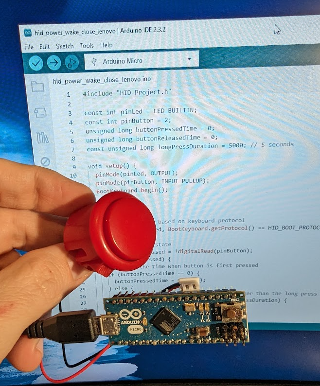

# HID PC Control for Batocera running on a Lenovo Mini PC

Control a Batocera-powered arcade system running on a Lenovo mini PC using an Arduino Micro that emulates a keyboard.

## Features

Use this project to control a Lenovo mini PC and Batocera-powered arcade machine using an extra arcade button wired to an Arduino Micro connected to a USB port.

- Power on a Lenovo mini PC
- Wake up a Lenovo mini PC from suspended mode
- Shutdown Batocera Linux
- Suspend Batocera Linux
- Close focused app

## Parts
- Arduino Micro (ATmega32U4)
- USB Cable
- Arcade button
- Arcade button wiring
- Lenovo mini PC

## Installation and Configuration

1. Program the Arduino Micro with the hid-pc-control.ino file
2. Connect the programmed Arduino Micro to the keyboard USB port on a Lenovo Mini PC
3. Wire an extra arcade button to pin 2 and ground of the Arduino Micro
4. Copy multimedia_keys.config to /userdata/system/configs
5. Enable suspend mode in the Batocera config file
6. Enable Alt+p in the Lenovo mini PC BIOS power config

